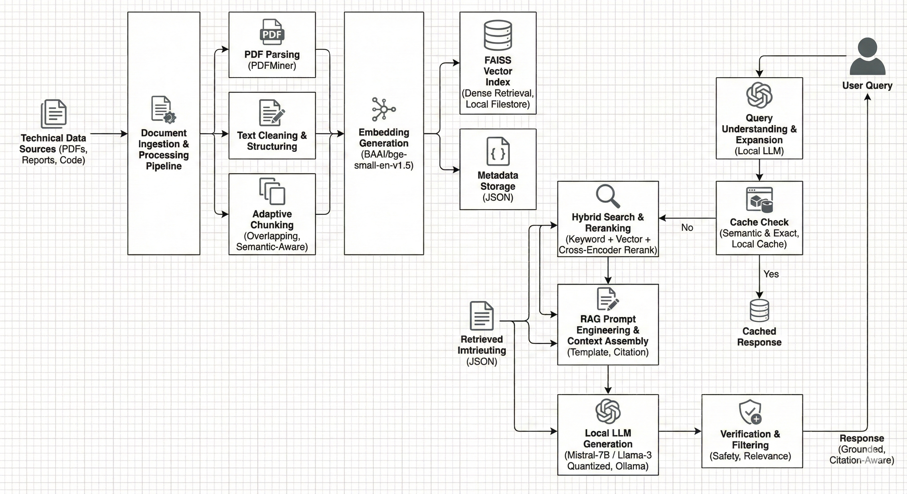

# Local RAG Pipeline for Technical Documentation

---

## Overview

This project implements a secure, modular RAG pipeline capable of ingesting complex PDF documentation (research papers, technical specs), indexing them efficiently, and generating grounded answers using local LLMs (Mistral / Llama 3).

### Key Goals
* **Privacy-First:** Zero data leakage. All embeddings and inference run locally.
* **Production-Grade Architecture:** Modular design separating ingestion, indexing, and generation.
* **Scientific Precision:** Optimized for dense technical content (e.g., Signal Processing, ML Research).
* **Measurable Quality:** Includes an "LLM-as-a-Judge" evaluation pipeline to benchmark performance.

---

## Architecture

The pipeline follows a strict modular flow:

1.  **Ingestion:** Automated fetching of papers via `arXiv API` (or local PDFs).
2.  **Processing:** Layout-aware parsing using `pdfminer.six`.
3.  **Chunking:** Adaptive sliding-window strategy (800 tokens + 100 overlap) to preserve semantic context.
4.  **Embedding:** Dense vector generation using **BAAI/bge-small-en-v1.5**.
5.  **Vector Store:** High-performance similarity search with **FAISS**.
6.  **Generation:** Context-aware inference using **Ollama** (Mistral 7B).

   

  

 

---

### Future Improvements
- Add Hybrid Search (Keyword + Vector).

- Implement re-ranking (Cross-Encoders) for higher precision.

- Support for Tables and Figures extraction.
